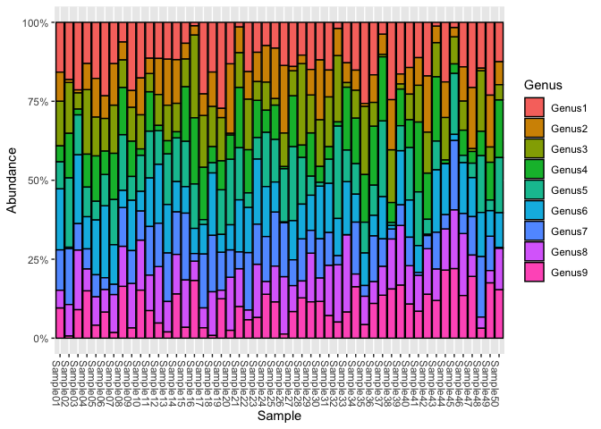
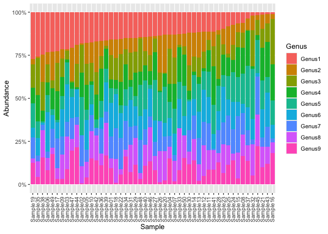
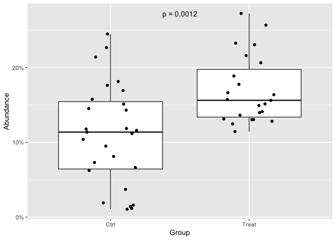
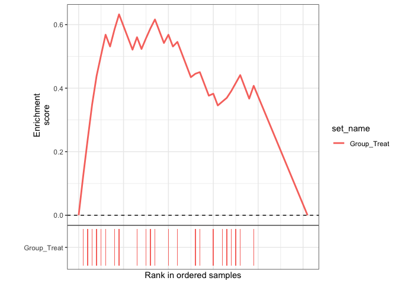
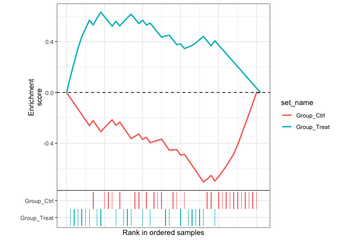

<!-- README.md is generated from README.Rmd. Please edit that file -->

# Microbiome Genus Set Enrichment Analysis (mgsea)

<!-- badges: start -->

<!-- badges: end -->

The goal of `mgsea` is to enable Genus Set Enrichment Analysis
(GSEA)[^1] for microbiome data, allowing researchers to identify
associations between microbial taxa and sample metadata features. This
package provides a streamlined workflow for performing GSEA on
microbiome datasets, leveraging the `phyloseq` object structure and the
`fgsea` algorithm.

## Installation

You can install the development version of `mgsea` from
[GitHub](https://github.com/) with:

``` r
# install.packages("pak")
pak::pak("SyntheticCommunity/mgsea")
```

## Example Dataset

This is a basic example which shows you how to use this package:

``` r
library(mgsea)
```

Initialize a test `phyloseq` object:

``` r
library(phyloseq)
ps = ps_test_data
ps
#> phyloseq-class experiment-level object
#> otu_table()   OTU Table:         [ 9 taxa and 50 samples ]
#> sample_data() Sample Data:       [ 50 samples by 2 sample variables ]
#> tax_table()   Taxonomy Table:    [ 9 taxa by 1 taxonomic ranks ]
```

Check `ps` is correctly loaded:

1.  OTU table

    ``` r
    otu_table(ps)
    #> OTU Table:          [9 taxa and 50 samples]
    #>                      taxa are rows
    #>      Sample01 Sample02 Sample03 Sample04 Sample05 Sample06 Sample07 Sample08
    #> OTU1       79       80       95       60      100      101       81       30
    #> OTU2       46        4        4       38       69       31       82       27
    #> OTU3       71       71       23       94       69       45       95       42
    #> OTU4       25       62        8       48       81       32       91       72
    #> OTU5       43       97       56       43       33       43       89       85
    #> OTU6       97        2       97       47       98       99       78       26
    #> OTU7       64       78       37       29       39       16       20       59
    #> OTU8       28       44       84       32       51       31       75       61
    #> OTU9       48        3       40       69       23       36       11       79
    #>      Sample09 Sample10 Sample11 Sample12 Sample13 Sample14 Sample15 Sample16
    #> OTU1      127       80       73       55       65       68       31        4
    #> OTU2       31       53       31       55       82       80       23       11
    #> OTU3       63       49       37       47       63       52       41       99
    #> OTU4       66        9       80        8       23       11       81       79
    #> OTU5       44       52       95       51       90       80       67       53
    #> OTU6       94       28       99       90       86       55       39       30
    #> OTU7       61       42       99       66       86       78       99        9
    #> OTU8       83       72       72       86       54       72       70       23
    #> OTU9       19       69       56       23       11       81       16       69
    #>      Sample17 Sample18 Sample19 Sample20 Sample21 Sample22 Sample23 Sample24
    #> OTU1       90       74      131       53        7       72       45       42
    #> OTU2       27       51       14       89       40       40       44       67
    #> OTU3       65       60       66        2       54       74       28       51
    #> OTU4       66       24       44       31       94       63       56       40
    #> OTU5        6       15       68       84       81       21       32       99
    #> OTU6       37       93       27       32       81       66       98       91
    #> OTU7       68       84       58       35       26       84       60       82
    #> OTU8       25       65       13       68       59       14       80       23
    #> OTU9       13        4       60       10       49       27       31       80
    #>      Sample25 Sample26 Sample27 Sample28 Sample29 Sample30 Sample31 Sample32
    #> OTU1       36       63       53       35       87       61       89        6
    #> OTU2       71       99        5        9       47       98       50       27
    #> OTU3        9       49       30       87       70       76       93       66
    #> OTU4       48        3       61       13       80       26       23        4
    #> OTU5       60       78       89       50       35        6       45       92
    #> OTU6       42        1       47       37       65       86       92       37
    #> OTU7       76       79       31       45       42       64       61        9
    #> OTU8       50       84       31       18       90       38       94       57
    #> OTU9       51        6       32       43       67       60       42       16
    #>      Sample33 Sample34 Sample35 Sample36 Sample37 Sample38 Sample39 Sample40
    #> OTU1       45       91      114       80       15       85       83       73
    #> OTU2       22       38        4       42       26       55       16       43
    #> OTU3        5       53       96       36        3       58        8       41
    #> OTU4       70       87       67       90       82       22       59       45
    #> OTU5       35       58       43       46       97        3       40       85
    #> OTU6       59       53       46       31       54        4       87       60
    #> OTU7        0       99       15       70       35       11       33       46
    #> OTU8       86       24       40       33       37       55       96       62
    #> OTU9       29       98       19       53       55       54       85       55
    #>      Sample41 Sample42 Sample43 Sample44 Sample45 Sample46 Sample47 Sample48
    #> OTU1       50       89        4       84        6       69       95       74
    #> OTU2       39       94       18       50       11       53       89        4
    #> OTU3       52       68       37       60       32       45        4       98
    #> OTU4       99       77       70        5       11       39       17       39
    #> OTU5       76       25       31        0       72       11       21       92
    #> OTU6       38        2       68       72        7       79       57       71
    #> OTU7        4       22       40       20       82       31       56       98
    #> OTU8       51       76       34       58       69       96       31       18
    #> OTU9       38       73       41       96       82       66       90       16
    #>      Sample49 Sample50
    #> OTU1      125       60
    #> OTU2       89       35
    #> OTU3       26       23
    #> OTU4       65       88
    #> OTU5       18       84
    #> OTU6       44       53
    #> OTU7       59        1
    #> OTU8       21       63
    #> OTU9       95       74
    ```

2.  Taxonomy table

    ``` r
    tax_table(ps)
    #> Taxonomy Table:     [9 taxa by 1 taxonomic ranks]:
    #>      Genus   
    #> OTU1 "Genus1"
    #> OTU2 "Genus2"
    #> OTU3 "Genus3"
    #> OTU4 "Genus4"
    #> OTU5 "Genus5"
    #> OTU6 "Genus6"
    #> OTU7 "Genus7"
    #> OTU8 "Genus8"
    #> OTU9 "Genus9"
    ```

3.  Sample data

    ``` r
    sample_data(ps)
    #>          Group Source
    #> Sample01  Ctrl  Fecal
    #> Sample02  Ctrl   Oral
    #> Sample03  Ctrl   Oral
    #> Sample04 Treat   Oral
    #> Sample05 Treat   Oral
    #> Sample06 Treat  Fecal
    #> Sample07 Treat  Fecal
    #> Sample08  Ctrl  Fecal
    #> Sample09 Treat  Fecal
    #> Sample10  Ctrl  Fecal
    #> Sample11  Ctrl   Oral
    #> Sample12 Treat  Fecal
    #> Sample13  Ctrl   Oral
    #> Sample14  Ctrl   Oral
    #> Sample15  Ctrl  Fecal
    #> Sample16  Ctrl  Fecal
    #> Sample17  Ctrl  Fecal
    #> Sample18 Treat   Oral
    #> Sample19 Treat   Oral
    #> Sample20 Treat   Oral
    #> Sample21  Ctrl   Oral
    #> Sample22 Treat  Fecal
    #> Sample23  Ctrl  Fecal
    #> Sample24  Ctrl  Fecal
    #> Sample25  Ctrl  Fecal
    #> Sample26 Treat  Fecal
    #> Sample27 Treat   Oral
    #> Sample28  Ctrl  Fecal
    #> Sample29 Treat  Fecal
    #> Sample30  Ctrl   Oral
    #> Sample31  Ctrl   Oral
    #> Sample32  Ctrl  Fecal
    #> Sample33 Treat   Oral
    #> Sample34 Treat  Fecal
    #> Sample35 Treat  Fecal
    #> Sample36 Treat   Oral
    #> Sample37  Ctrl  Fecal
    #> Sample38  Ctrl  Fecal
    #> Sample39 Treat  Fecal
    #> Sample40  Ctrl  Fecal
    #> Sample41  Ctrl  Fecal
    #> Sample42  Ctrl   Oral
    #> Sample43  Ctrl  Fecal
    #> Sample44 Treat   Oral
    #> Sample45  Ctrl  Fecal
    #> Sample46 Treat   Oral
    #> Sample47 Treat  Fecal
    #> Sample48  Ctrl   Oral
    #> Sample49 Treat   Oral
    #> Sample50 Treat   Oral
    ```

## Overview

We can now visualize the abundance of all genera across samples:

``` r
library(ggplot2)
ps_genus = tax_glom(ps, "Genus")
ps_genus = transform_sample_counts(ps_genus, function(x) x / sum(x))
plot_bar(ps_genus, fill = "Genus") +
    scale_y_continuous(labels = scales::percent_format())
#> Warning: `aes_string()` was deprecated in ggplot2 3.0.0.
#> ℹ Please use tidy evaluation idioms with `aes()`.
#> ℹ See also `vignette("ggplot2-in-packages")` for more information.
#> ℹ The deprecated feature was likely used in the phyloseq package.
#>   Please report the issue at <https://github.com/joey711/phyloseq/issues>.
#> This warning is displayed once per session.
#> Call `lifecycle::last_lifecycle_warnings()` to see where this warning was
#> generated.
```



``` r
library(dplyr)
#> 
#> Attaching package: 'dplyr'
#> The following object is masked from 'package:testthat':
#> 
#>     matches
#> The following objects are masked from 'package:stats':
#> 
#>     filter, lag
#> The following objects are masked from 'package:base':
#> 
#>     intersect, setdiff, setequal, union

ps_data = psmelt(ps_genus)

sample_order_by_genus1 = ps_data |> 
    filter(Genus == "Genus1") |> 
    arrange(desc(Abundance)) |>
    pull(Sample)

ps_sorted = ps_data |> 
    mutate(Sample = factor(Sample, levels = sample_order_by_genus1))

ggplot(ps_sorted, aes(x = Sample, y = Abundance, fill = Genus)) +
    geom_bar(stat = "identity") +
    scale_y_continuous(labels = scales::percent_format()) +
    theme(axis.text.x = element_text(angle = 90, vjust = 0.5, hjust=1))
```



When we plot the abundance of “Genus1” across samples, we can see that
it is more abundant in “Treat” group than “Ctrl” group:

``` r
ps_genus1 = subset_taxa(ps_genus, Genus == "Genus1")
ps_data = psmelt(ps_genus1)

p_value = wilcox.test(Abundance ~ Group, data = ps_data)$p.value

ggplot(ps_data, aes(x = Group, y = Abundance)) +
    geom_boxplot() +
    geom_jitter(width = 0.2) +
    scale_y_continuous(labels = scales::percent_format()) +
    annotate("text", x = 1.5, y = max(ps_data$Abundance), label = paste0("p = ", signif(p_value, 2))) 
```



## Run Analysis

Run GSEA analysis:

``` r
gsea_res <- run_microbiome_gsea(
    ps = ps,
    taxon_target = "Genus1",
    taxon_rank = "Genus",
    sample_feat = "Group"
)
#> Calculating ranked abundance for: Genus1 ...
#> Generating sample sets for feature: Group ...
#> Running GSEA analysis...
#> Warning in preparePathwaysAndStats(pathways, stats, minSize, maxSize, gseaParam, : There are ties in the preranked stats (22% of the list).
#> The order of those tied genes will be arbitrary, which may produce unexpected results.

gsea_res
#> # A tibble: 2 × 8
#>   pathway          pval     padj log2err     ES   NES  size leadingEdge
#>   <chr>           <dbl>    <dbl>   <dbl>  <dbl> <dbl> <int> <list>     
#> 1 Group_Ctrl  0.0000832 0.000166   0.538 -0.704 -2.07    27 <chr [13]> 
#> 2 Group_Treat 0.00142   0.00142    0.455  0.632  1.98    23 <chr [8]>
```

## Visualization

Plot a single GSEA curve:

``` r
gsea_plot(gsea_res, "Group_Treat")
```



Plot Curves for all significant sets:

``` r
gsea_plot_all(gsea_res, filter = FALSE, ncol = 1)
```



[^1]: Honestly, GSEA is a computational method that determines whether a
    predefined set of genes (or in this case, samples) shows
    statistically significant, concordant differences between two
    biological states. In the context of microbiome data, we adapt this
    concept to analyze whether certain sample groups are enriched in
    samples with high or low abundance of a target taxon.
